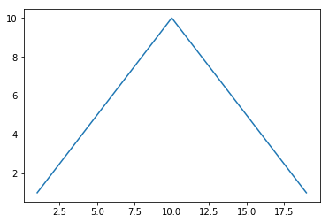

```python
def draw_a_triangle(peak):
    for i in range(1, peak * 2):
        print '*' * min(i, 2 * peak - i)

draw_a_triangle(10)
```
    *
    **
    ***
    ****
    *****
    ******
    *******
    ********
    *********
    **********
    *********
    ********
    *******
    ******
    *****
    ****
    ***
    **
    *


```python
import matplotlib.pyplot as plt

def plot_a_triangle(peak):
    x = range(1, peak * 2)
    y = [min(xi, 2 * peak - xi) for xi in x]
    plt.plot(x, y)
    plt.show()

plot_a_triangle(10)
```



