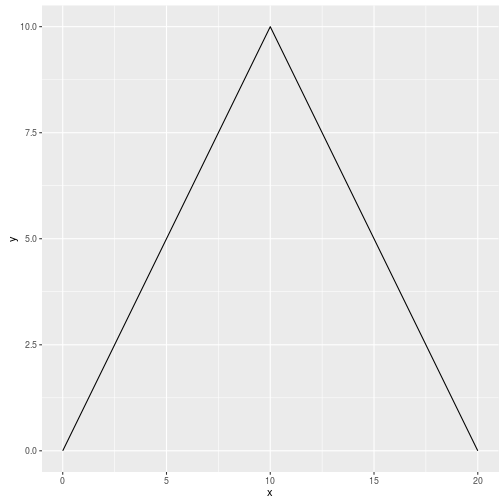

# Triangles

Let's build a simple triangle:


```r
suppressPackageStartupMessages(library('ggplot2'))

peak <- 10
data <- data.frame(x=0:(2*peak))
data$y <- pmin(data$x, 2*peak - data$x)
ggplot(data, aes(x=x, y=y)) + geom_line()
```


